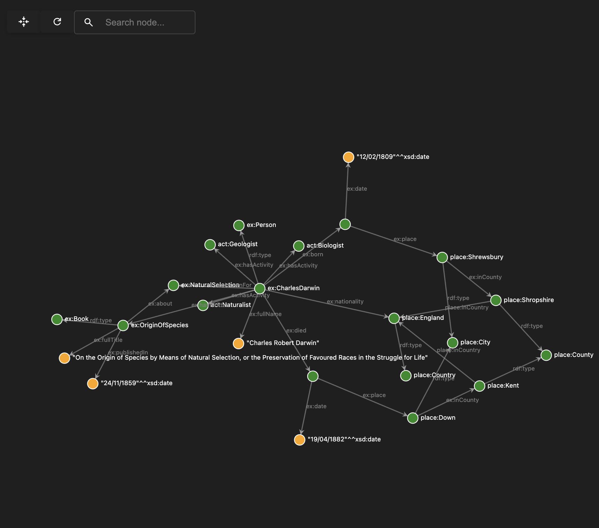

# RDF-Preview

RDF-Preview is a Visual Studio Code extension that provides a quick and interactive visualization of RDF graphs.

## Features

- **Format Support**: Preview **Turtle** (`.ttl`) or **N-Triples** (`.nt`/`.n3`) RDF graphs in a separate tab.
- **Interactive Graph**: Drag and move nodes around to reorganize your view.
- **Search**: Quickly find specific nodes and links within the graph.
- **Highlighting**: Visually highlight nodes and links for better exploration.

## Usage

1. Open a file containing an RDF graph (e.g., `.ttl`, `.nt`, or `.n3`).
2. Click the **Preview RDF Graph** button in the editor title bar or execute the `Preview RDF Graph` command from the Command Palette (`Ctrl+Shift+P` / `Cmd+Shift+P`).
3. A new panel will open on the side displaying your interactive RDF graph.

---
