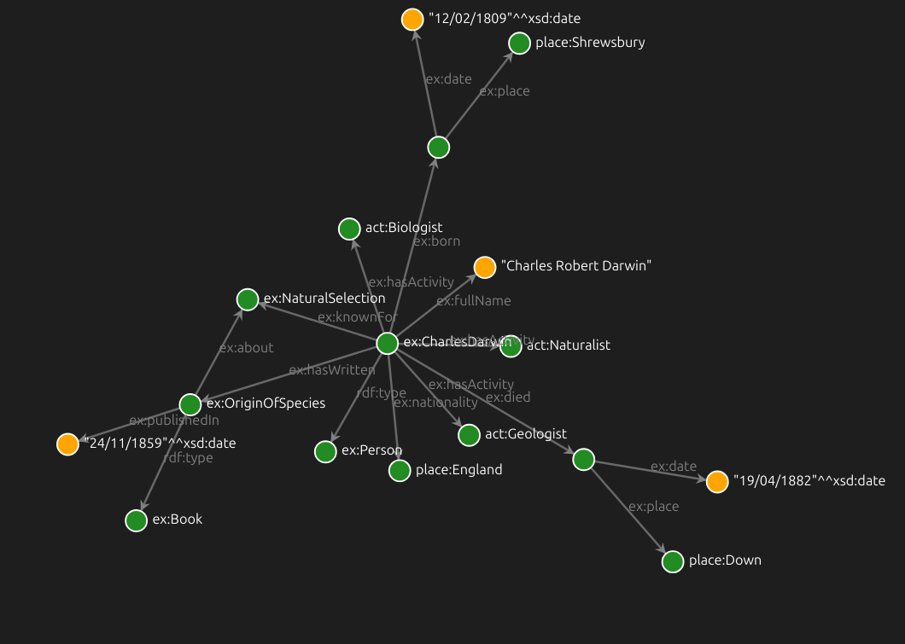

# RDF-Preview 

RDF-Preview is a vscode extension which provide a quick visualization of RDF Graph. 

## Features

- Preview **Turtle** of **N-Triples** RDF Graph in a separate tab. 

## Usage 

- Open a file containing a RDF graph in Turtle (`.ttl`) or N-Triples/N3 (`.nt`)
- Then Click on the Preview RDF Graph button or execute the `Preview RDF Graph` command
- A new panel will open on the side containing your RDF Graph.

---
